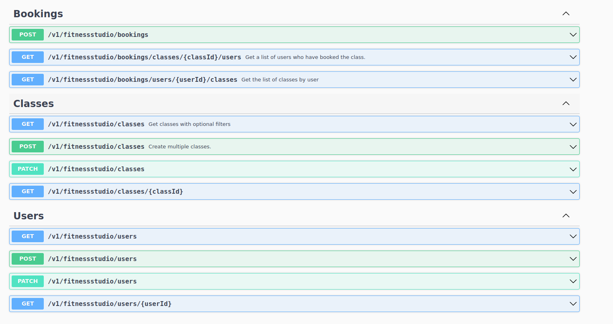
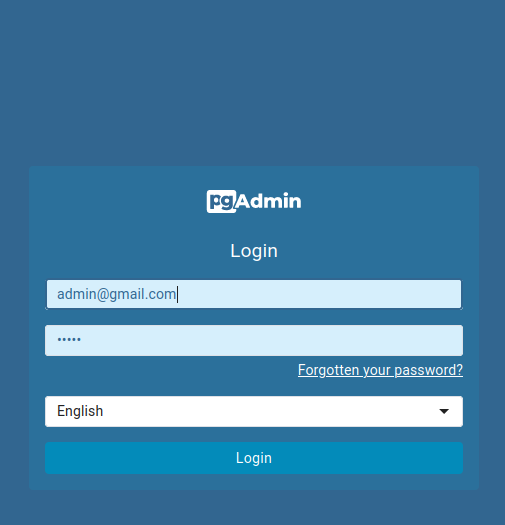
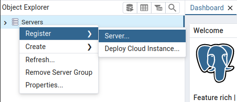
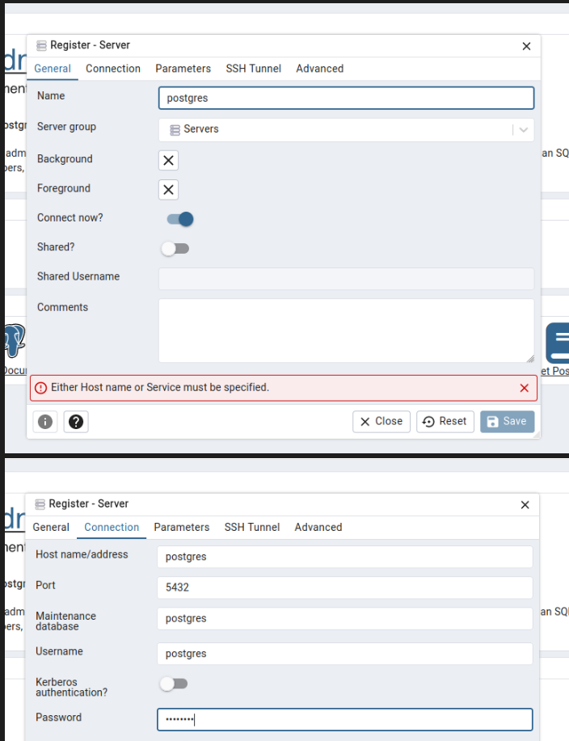
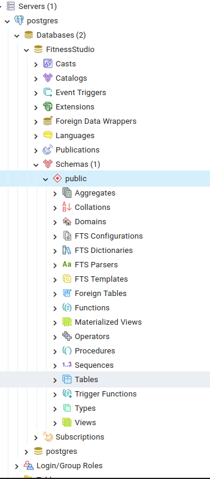
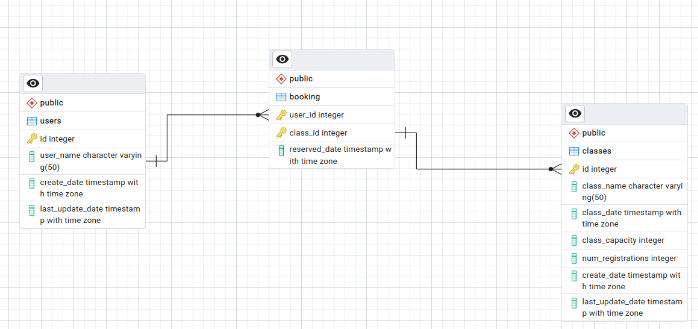

# fitnessStudioApp

## Descriptions
This project is a simple REST API designed to enable studio owners to manage their classes through CRUD operations. Users can create accounts and register for classes, taking into account the class capacity and existing reservations.

Key features include:
- CRUD operations for studio classes
- CRUD operations for users
- User registration and class enrollment functionality
- Capacity management to handle reservations effectively
- Unit and integration tests covering all use cases
- Handling of race conditions and performance optimization (explain in the section Possible race conditions)

## Prerequisites

Before running this project, ensure you have the following dependencies installed:

- GO version 1.22.1
- Docker
- A tool capable of running Makefiles

These prerequisites are necessary for building and running the project successfully.

### Considerations

- The Postgres database will run on port **5432**, and pgAdmin will also run on port **5050**. Ensure that no other services are utilizing these ports when testing the application.
- Note that when Docker stops, all data in the database will be lost. This behavior is intentional. If there's a need to persist data even after Docker is down, please modify the Docker Compose file accordingly.
- During integration tests, a Docker container with a Postgres database will also be started on port **5432**. Ensure that the database for the application is not running when running these integration tests. Or change the port in the **migration-local.yml** file.
- To enhance performance and prevent race conditions during class creation, a sync.Map is used, functioning as a cache. This cache blocks goroutines based on a key value (year-month) to prevent multiple goroutines from writing classes for the same day simultaneously. In a real scenario, the key value could be more specific, such as country-studioId-year-month-day. However, note that this cache is in memory, so restarting the server will clear all cached data. Ensure to restart the Docker Compose to reset the cache accordingly.
-  If for some reason when running the go mod tidy the dependencies are not available use the branch XXXX that will have the vendor folder with all dependencies.

##  How to Start the Application

To run the application, follow these steps:

1. Run coomand go mod tidy to have all dependencies

2. Just need to run the command **make** in the root folder. This will execute the Docker Compose file, run migrations, and start the application.
    
3. Once the application is running, open http://localhost:8080/swagger/index.html#/ in your web browser. This URL hosts the Swagger documentation, providing details about the available endpoints and how to interact with them.

After starting the application, you can also monitor the database in real-time:
- Access localhost:5050/browser in your web browser.
- Log in using the credentials:
    - Email: admin@gmail.com
    - Password: admin
- Navigate to the server by clicking the right button and selecting "Register" and then "Server".
- Configure the database connection with the following details:
    - General:
        - Name: postgres
    - Connections:
        - Hostname: postgres
        - Port: 5432
        - Maintenance database: postgres
        - Username: postgres
        - Password: postgres

Images to understand how to do it:
1.º

2.º 

3.º

After configuring the connection, you'll be able to view the databases, including FitnessStudio, and explore the tables created, tracking the data being stored.

## Database Structure

## Race Conditions Approach

In this solution, we address three scenarios where race conditions can potentially occur:

1. **Creating Classes for Multiple Days**:
    
    - In this scenario, the challenge is to ensure that only one class per day is created. To tackle this, we utilize a `sync.Map` with a structure that organizes classes by month and day, essentially forming a map of slices. This ensures that if one goroutine is processing a request for a specific month, others must wait until it completes. However, if the goroutines are working on different months, they can run in parallel.
    - In a real-world scenario, the locking mechanism would likely be more sophisticated, possibly using a key value like `studio+day+year+country`, allowing for more granular control.
2. **Handling Class Reservation Limits**:
    
    - This scenario deals with ensuring that reservations cannot exceed the class capacity. Race conditions must be addressed in two cases:
        1. When making a reservation, we update the booking database and increment the "num_registrations" in the class table. To achieve this, we utilize a transaction with the `SELECT FOR UPDATE` feature provided by PostgreSQL. This feature allows us to lock only the rows being updated, allowing other goroutines working on different rows to proceed independently. Transactions are used to maintain data consistency. If any error occurs during the reservation process, the transaction ensures that all changes are rolled back, maintaining data integrity.
        2. When updating a class we also use the same strategy of `SELECT FOR UPDATE` to avoid race conditions.

These strategies effectively mitigate race conditions and ensure the consistency and integrity of the data in the application.

## How to run tests
For running unit tests: `make run-unittests`
For running integration tests: `make run-integrationtests` (not forget to change the port or shutdown the application)
For run all tests: make `run-alltests`